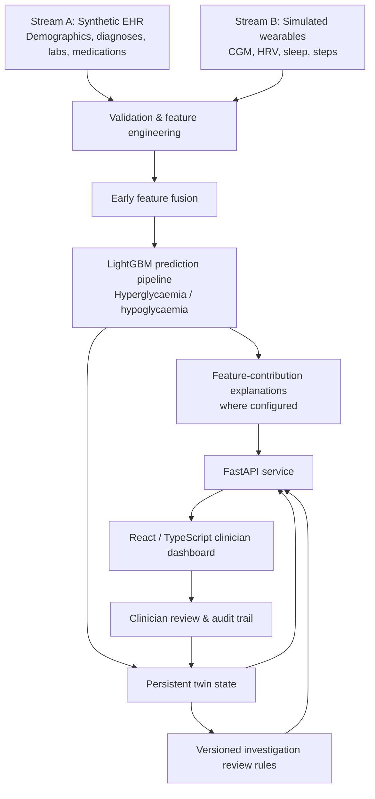

# GlucoTwin Architecture

```mermaid
flowchart TD
  EHR["Stream A: Synthetic EHR<br/>Demographics, diagnoses, labs, medications"]
  WEAR["Stream B: Simulated wearables<br/>CGM, HRV, sleep, steps"]
  FEAT["Validation & feature engineering"]
  FUSION["Early feature fusion"]
  MODEL["LightGBM prediction pipeline<br/>Hyperglycaemia / hypoglycaemia"]
  EXPLAIN["Feature-contribution explanations<br/>where configured"]
  STATE["Persistent twin state"]
  RULES["Versioned investigation review rules"]
  API["FastAPI service"]
  UI["React / TypeScript clinician dashboard"]
  AUDIT["Clinician review & audit trail"]
  EHR --> FEAT
  WEAR --> FEAT
  FEAT --> FUSION --> MODEL
  MODEL --> EXPLAIN
  MODEL --> STATE --> RULES
  EXPLAIN --> API
  RULES --> API
  STATE --> API
  API --> UI --> AUDIT
  AUDIT --> STATE
```

Synthetic data only. Diagram represents the project-level design; confirm exact implementation details against source before real integration.
